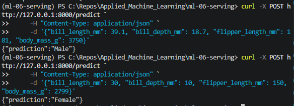

# ml-06-serving

[](https://denisecase.github.io/pro-analytics-02/workflow-b-apply-example-project/)
[](./pyproject.toml)
[](./LICENSE)

> Professional Python project: deploying and serving machine learning models.

## Project Description

This project focuses on learning to deploy a trained model so others can use it.

We learn to:

- save and load a trained model
- wrap a model in a simple API or script
- validate inputs and handle errors gracefully
- think about drift, versioning, and monitoring

## Project Dependencies

This project needs additional dependencies

```toml
    "fastapi[standard]", # for serving - a web framework for building APIs
    "uvicorn",           # for serving - ASGI server for FastAPI
    "joblib",            # for model serialization (saving and loading models)
```

## Example Notebook + Your Notebook

Keep the example notebook as it is.
Either copy it or use it to build a new notebook that ends in \_yourname.
See [docs/your-files.md](docs/your-files.md) for more.

Links:

- [ml_06_case.ipynb](notebooks/ml_06_case.ipynb)

## Working Files

You'll work with these areas:

- **data/raw** - raw data for exploration (only if you add a dataset)
- **docs/** - project narrative and documentation
- **src/mlstudio/** - the app is an example; run only (no need to modify)
- **notebooks/** - interactive analysis
- **pyproject.toml** - update authorship & links
- **zensical.toml** - update authorship & links

## Instructions (pro-analytics-02)

Follow the
[step-by-step workflow guide](https://denisecase.github.io/pro-analytics-02/workflow-b-apply-example-project/)
to complete:

1. Phase 1. **Start & Run**
2. Phase 2. **Change Authorship**
3. Phase 3. **Read & Understand**
4. Phase 4. **Modify**
5. Phase 5. **Apply**


### In a machine terminal (open in your `Repos` folder)

After you get a copy of this repo in your own GitHub account,
open a machine terminal in your `Repos` folder:

```shell
# Replace username with YOUR GitHub username.
git clone https://github.com/kehummel/ml-06-serving

cd ml-06-serving
code .
```

## Example
Follow the example provided by Denise Case by following the ORIGINAL_README.md document. Then come back and follow the changed version created in Phase 4 of the project.
[Original README](ORIGINAL_README.md)

## Phase 4: Determining Sex of Penguin on a Server

### TASK 1: train the example model and save it to artifacts/model.joblib.

uv run python -m mlstudio.model_builder_hummel

### Terminal 2: Right-click and Rename "server"

Open a second terminal. Right-click to rename this terminal "server".

Run:

```shell
# Task 2. Start the example server
uv run fastapi dev src/mlstudio/serve_hummel.py
```

### Terminal 3: Right-click and Rename "client"

Open a third terminal.
Right-click and rename it "client".

Use this terminal to **send a request** to the server.

We are making a request to the "/predict" endpoint.

Provide information about a penguin and ask
for the predicted sex.

### Windows PowerShell

```shell
# Task 3. Send a request to the server

curl -X POST http://127.0.0.1:8000/predict `
     -H "Content-Type: application/json" `
     -d '{"bill_length_mm": 39.1, "bill_depth_mm": 18.7, "flipper_length_mm": 181, "body_mass_g": 3750}'
```

Should return the predicted result as JSON data:

```json
{ "prediction": "male" }
```
A second example is:

```shell
curl -X POST http://127.0.0.1:8000/predict `
     -H "Content-Type: application/json" `
     -d '{"bill_length_mm": 30, "bill_depth_mm": 10, "flipper_length_mm": 150, "body_mass_g": 2799}'
```

Should return the predicted result as JSON data:
```json
{ "prediction": "female" }
```

### Findings and Visuals

In phase 4 I only completed the contracts for Powershell since that is what I was using. I also only completed the json predictor as I was not ready to create extra accounts. I will attempt this during phase 5 of the project.

json for Penguin Sex Predictor




## Phase 5

In phase 5 I used a dataset from Module 5 to create a server and test information on it. Using the three features glucose, BMI, and age the model would predict if the person had diabetes or not and give the percentage of that prediction as well.

### TASK 1: train the example model and save it to artifacts/model2.joblib.

uv run python -m project06.model_builder_project06

### Terminal 2: The server

Open a second terminal. Right-click to rename this terminal "server".

Run:

```shell
# Task 2. Start the example server
uv run fastapi dev project06/serve_project06.py
```

### Terminal 3: Client

Open a third terminal.
Right-click and rename it "client".

Use this terminal to **send a request** to the server.

We are making a request to the "/predict" endpoint.

Provide information about a person and ask
for the predicted whether or not they have diabetes.

### Windows PowerShell

```shell
curl -X POST http://127.0.0.1:8000/predict `
         -H "Content-Type: application/json" `
         -d '{"glucose": 117, "BMI": 32, "age": 29}'
```
Should return the predicted result as JSON data:
```json
{"prediction":"Not Diabetic","probability":{"Diabetic":0.185,"Not Diabetic":0.815},"warnings":[]}
```
### Findings and Visuals
Using different scenarios, I testing the server to make sure I got different outcomes and warnings. See index for visuals and more detailed explanation.

## Project Documentation

Additional project instructions, terms, and notes:

[docs/index.md](docs/index.md)

## Phase 4 Documentation

Run 1st to train the model and save it to artifacts/model.joblib

[model_builder_hummel.py](src/mlstudio/model_builder_hummel.py)

Run 2nd in a new terminal to start the example server

[server_hummel.py](src/mlstudio/serve_hummel.py)

Notebook for Phase 4

[ml_06_serve_model_hummel.ipynb](notebooks/ml_06_serve_model_hummel.ipynb)

## Phase 5 Documentation

Run 1st to train the model and save it to artifacts/model2.joblib

[model_builder_project06.py](project06/model_builder_project06.py)

Run 2nd in a new terminal to start the example server

[server_project06.py](project06/serve_project06.py)

Notebook for Phase 5

[project_serve_model.ipynb](project06/project06_serve_model.ipynb)

Notebook used to determine best model and most important features

[ml_06_important_features.ipynb](project06/ml_06_important_features.ipynb)

## Citation

[CITATION.cff](./CITATION.cff)

## License

[MIT](./LICENSE)
